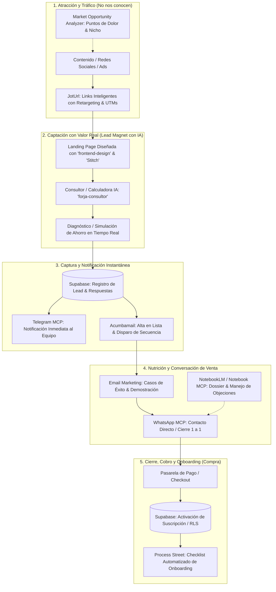

# 🚀 Directriz Maestra #6: Flujo Integral de Conversión y Ventas con Antigravity
## De Desconocido a Cliente (End-to-End Growth Engine)

> **Ubicación Google Drive:** `Google Drive > Mi unidad > 1-Proyectos > Apps-Desarrollo > Directrices > 06_Flujo_Conversion_EndToEnd.md`  
> **Estado:** Activo  
> **Responsable Metodológico:** Toni (Antonio Javier García García)

---

## 🗺️ 1. Diagrama de Flujo del Embudo

---

## 🛠️ 2. Desglose Operativo por Fases y Herramientas

### 🎯 Fase 1: Atracción y Alcance (*"No nos conocen"*)
- **`market-opportunity-analyzer`**: Identifica nichos con alta disposición de pago y redacta ganchos basados en problemas reales y desatendidos.
- **`joturl`**: Enruta el tráfico mediante enlaces cortos con píxeles de retargeting (Meta, Google, LinkedIn) y analítica de clics para alimentar audiencias personalizadas.

---

### 💡 Fase 2: Captación con Valor Inmediato (*"Descubren la solución"*)
- **`frontend-design`**: Aplica un diseño visual sobrio, con tipografía cuidada y sin clichés de IA para transmitir confianza inmediata.
- **`stitch` / `pencil`**: Prototipado y maquetación ágil de la interfaz visual.
- **`forja-consultor` / `consultor-bikeflow`**: Ofrece un simulador/calculadora inteligente que entrega valor real (un presupuesto orientativo, un diagnóstico de madurez o un cálculo de ahorro frente a la competencia) a cambio de los datos de contacto.

---

### ⚡ Fase 3: Persistencia y Alertas Instantáneas (*"Captura del Lead"*)
- **`supabase`**: Almacena el nuevo lead, su puntuación de cualificación y las métricas calculadas en el esquema de base de datos protegido con RLS.
- **`telegram` (MCP Bot)**: Envía una alerta en tiempo real a tu canal privado para saber quién acaba de solicitar un diagnóstico.
- **`acumbamail`**: Sincroniza el lead con la lista de correo correspondiente y arranca el embudo de bienvenida.

---

### 🤝 Fase 4: Nutrición y Conversación (*"Decisión de Compra"*)
- **`acumbamail`**: Secuencia de correos automatizados con casos prácticos, desglose de la oferta y testimonios.
- **`whatsapp` (MCP)**: Canal directo para iniciar contacto consultivo personalizado por mensajería instantánea.
- **`notebooklm` / `notebook-mcp`**: Base de conocimiento sobre tus propuestas técnicas, FAQs y catálogo para responder con precisión y resolver objeciones al instante.

---

### 🚀 Fase 5: Compra y Entrega (*"Nos compran"*)
- **`supabase`**: Actualiza el estado del usuario a cliente activo y activa sus credenciales y permisos.
- **`vercel`**: Despliegue de la aplicación web y panel de usuario con alta disponibilidad.
- **`process-street`**: Dispara la ejecución del workflow de bienvenida, configuración técnica y seguimiento a 30 días para garantizar la retención.
